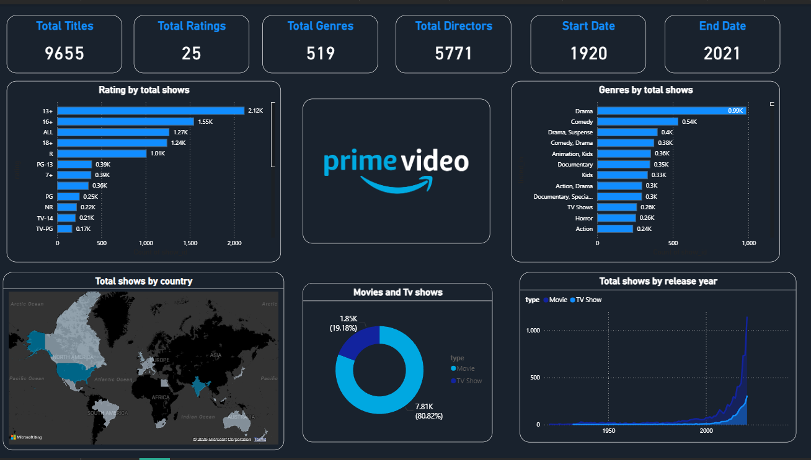

# Amazon Prime Video Dashboard 📊

## 📌 Overview
This Power BI dashboard provides a comprehensive analysis of Amazon Prime Video's content library.  
It includes metrics such as total titles, ratings, genres, directors, and trends over time. Interactive visuals allow for exploring insights about movies and TV shows across countries, genres, and release years.

---

## 📂 Folder Contents
- `amazon-prime-dashboard.pbix` → Power BI project file  
- `dataset` → (Optional) Dataset used for building the dashboard  
- `logo-pic` → Screenshots, PDFs, or images of the dashboard  

---

## 📊 Dashboard Highlights

1. **Key Metrics**
   - Total Titles: 9,655  
   - Total Ratings: 25  
   - Total Genres: 519  
   - Total Directors: 5,771  
   - Content Range: 1920 – 2021  

2. **Rating Distribution**
   - Shows the count of titles by rating categories such as 13+, 16+, R, PG-13, etc.

3. **Genres Analysis**
   - Visualizes the most common genres including Drama, Comedy, Animation, and Action.

4. **Geographical Distribution**
   - Maps total shows by country, highlighting regions with the most content.

5. **Content Type**
   - Pie chart showing the proportion of Movies vs. TV Shows.

6. **Trends Over Time**
   - Line chart showing the total number of shows released per year.

---

## 📸 Preview

---

## 🛠️ Tools Used
- Power BI Desktop  
- Excel/CSV Dataset (optional)  
- Microsoft Bing Maps for geospatial visuals  

---

## 🔑 Insights
- Movies dominate Amazon Prime Video’s library with ~80% of total titles.  
- Drama and Comedy are the most prevalent genres.  
- Significant growth in content after 2000, peaking in recent years.  
- Top contributing countries: United States, India, United Kingdom.  
