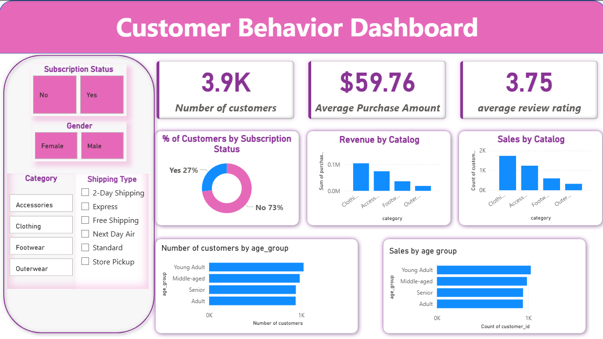

# Customer Trends Data Analysis Project

## Project Overview

This project focuses on analyzing customer purchasing behavior using SQL and visualizing key insights through an interactive Power BI dashboard. The objective is to identify trends in customer spending, product performance, discount usage, and subscription behavior to support data-driven business decisions.

The analysis is performed on a customer dataset containing demographic details, purchase history, and engagement metrics.

---

## Objectives

- Analyze revenue distribution across customer segments  
- Understand the impact of discounts and subscriptions on spending  
- Identify top-performing products and categories  
- Segment customers based on purchase history  
- Build an interactive Power BI dashboard for insights  

---

## Dataset Description

The dataset includes the following attributes:

- Customer ID  
- Gender  
- Age Group  
- Category and Item Purchased  
- Purchase Amount  
- Discount Applied  
- Shipping Type  
- Subscription Status  
- Previous Purchases  
- Review Rating  

---

## Business Questions Answered

1. What is the total revenue generated by male vs female customers?  
2. Which customers used discounts but still spent more than the average purchase amount?  
3. Which are the top 5 products with the highest average review rating?  
4. How does the average purchase amount compare between Standard and Express shipping?  
5. Do subscribed customers spend more than non-subscribers?  
6. Which 5 products have the highest percentage of discounted purchases?  
7. How many customers fall into New, Returning, and Loyal segments?  
8. What are the top 3 most purchased products in each category?  
9. Are repeat buyers more likely to subscribe?  
10. What is the revenue contribution of each age group?

---

## SQL Techniques Used

- Aggregate functions (SUM, AVG, COUNT)  
- Subqueries  
- Common Table Expressions (CTEs)  
- Window functions (ROW_NUMBER)  
- CASE statements for segmentation  

---

## Power BI Dashboard

The Power BI dashboard presents:

- Revenue analysis by gender and age group  
- Subscription vs non-subscription spending  
- Discount usage trends  
- Top products and categories  
- Customer segmentation insights  

---

## Tools and Technologies

- SQL  
- Power BI  
- PostgreSQL  

---

---

## Key Learnings

- Strengthened SQL querying and data analysis skills  
- Learned to transform business questions into actionable insights  
- Gained experience building dashboards using Power BI  

---

## Conclusion

This project demonstrates how SQL and Power BI can be combined to analyze customer data and generate meaningful insights that help businesses understand customer behavior and improve decision-making.

